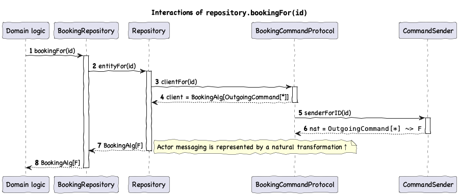
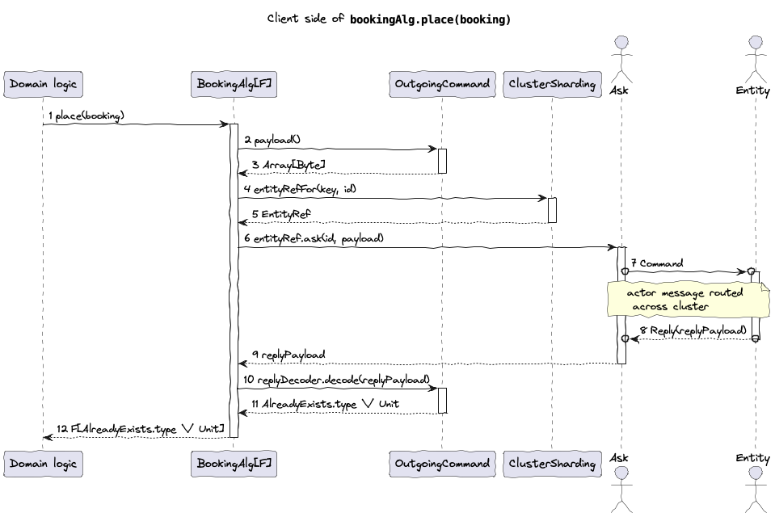
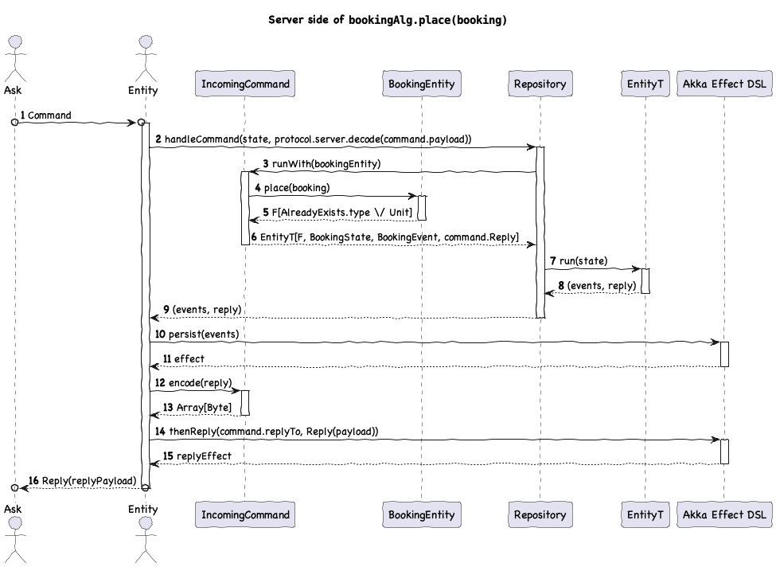

# Example app

Endless example application is a small API for managing imaginary bookings for passenger trips from some origin to some destination, as well as tracking positions and speeds of vehicles. It can be found in `endless-example` and can be run directly: `sbt run`. 

## API
It has a simple CRUD API for bookings and vehicles:

@@snip [ExampleApp](/example/src/main/scala/endless/example/app/HttpServer.scala) { #api }

## Scaffolding
The application is assembled via calls to @scaladoc[deployRepository](endless.core.entity.Deployer.deployRepository) (for bookings) and @scaladoc[deployDurableEntity](endless.core.entity.Deployer.deployDurableRepository) (for vehicles) (see @ref:[runtime](runtime.md) for more details)

Akka and Pekko runtimes essentially have the same API, so we'll use Pekko for the example:

@@snip [PekkoApp](/example/src/main/scala/endless/example/app/pekko/PekkoApp.scala) { #main } 

## Algebras
You might have spotted the two algebra types in the snippet above: 

### Repository

@@snip [BookingRepositoryAlg](/example/src/main/scala/endless/example/algebra/BookingRepositoryAlg.scala) { #definition }

Here's the sequence of operations happening behind the scenes when retrieving an instance of entity algebra: 

### Entity

@@snip [BookingAlg](/example/src/main/scala/endless/example/algebra/BookingAlg.scala) { #definition }

## Implementations
Implementation of the repository algebra is trivial using `Repository` instance (injected by `deployRepository`):

@@snip [BookingRepository](/example/src/main/scala/endless/example/logic/BookingRepository.scala) { #definition }

Implementation of entity algebra is done using the `Entity` typeclass instance (also injected by `deployRepository`):

@@snip [BookingEntity](/example/src/main/scala/endless/example/logic/BookingEntity.scala) { #definition }

## Event handling 

In this simple example, events essentially set fields in the state:

@@snip [BookingEventApplier](/example/src/main/scala/endless/example/logic/BookingEventApplier.scala) { #definition }

## Protocol
Command and reply encoding/decoding on client and server side is implemented with a subclass of `CommandProtocol`, in this case `ProtobufCommandProtocol` as we'll be using protobuf. On the client side, we translate invocations into instances of `OutgoingCommand` and make use of the `sendCommand` helper function:

@@snip [BookingCommandProtocol](/example/src/main/scala/endless/example/protocol/BookingCommandProtocol.scala) { #example-client }

On the server side, we decode instances of `IncomingCommand` and make use of `handleCommand` to trigger relevant entity logic and encode the reply:

@@snip [BookingCommandProtocol](/example/src/main/scala/endless/example/protocol/BookingCommandProtocol.scala) { #example-server }

Here's an illustration of the chain of interactions taking place when placing a booking, both from the client and the server side:

## Side-effects
We describe the *availability* process as well as entity passivation using `Effector`: 

@@snip [BookingEffector](/example/src/main/scala/endless/example/logic/BookingEffector.scala) { #definition }

## Testing

Unit testing for entity algebra implementation, event handling and effector benefits from to the parametric nature of `F`:   

@@snip [BookingEntitySuite](/example/src/test/scala/endless/example/logic/BookingEntitySuite.scala) { #example }

@@snip [BookingEventApplierSuite](/example/src/test/scala/endless/example/logic/BookingEventApplierSuite.scala) { #example }

@@snip [BookingEffectorSuite](/example/src/test/scala/endless/example/logic/BookingEffectorSuite.scala) { #example }

Command protocol can be also be covered in isolation with synchronous round-trip tests:

@@snip [BookingCommandProtocolSuite](/example/src/test/scala/endless/example/protocol/BookingCommandProtocolSuite.scala) { #example }

Component and integration tests using Akka or Pekko testkits are also advisable and work as usual, see @github[PekkoExampleAppSuite](/example/src/test/scala/endless/example/PekkoExampleAppSuite.scala).