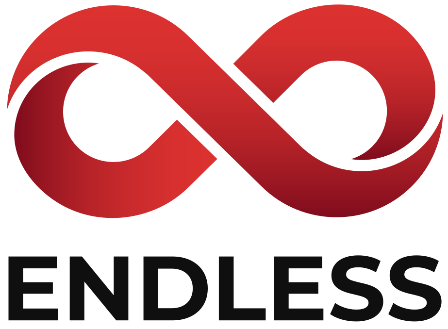

endless is a Scala library to describe sharded and event sourced entities using tagless-final algebras, running with built-in implementations for Akka.

@@@ note { .quote title="/ˈɛndləs/: having or seeming to have no end or limit" }
*endless* refers to the ever flowing stream of events capturing state evolution with event sourcing, and is a nod to *[tag-less](https://okmij.org/ftp/tagless-final/index.html)*.
@@@

@@@ index
* [Getting Started](getting-started.md)
* [In a nutshell](nutshell.md)
* [Abstractions](abstractions.md)
* [Akka runtime](runtime.md)
* [Example app](example.md)
* [Reference](reference.md)
* [Inspiration](inspiration.md)
* [Questions & answers](discord.md)
@@@
